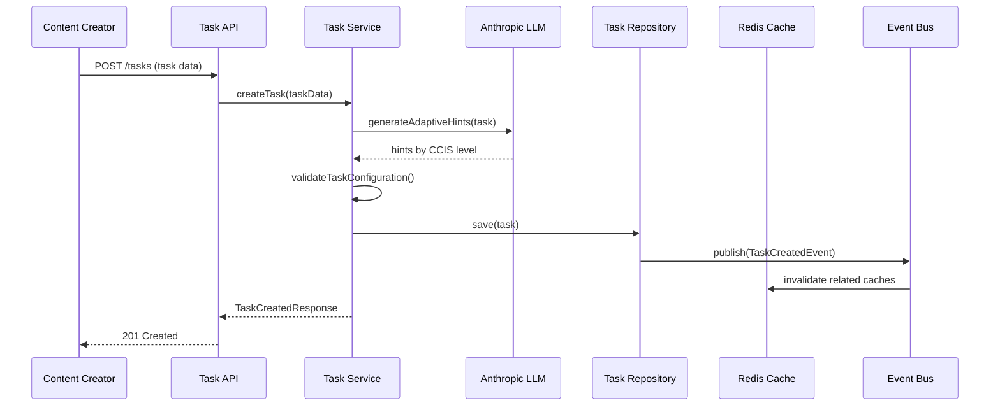
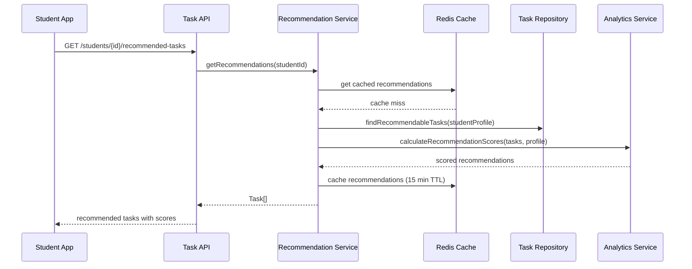
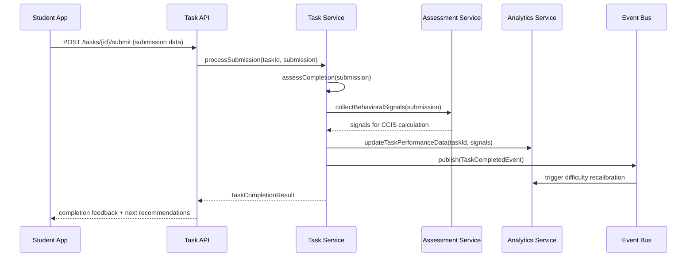
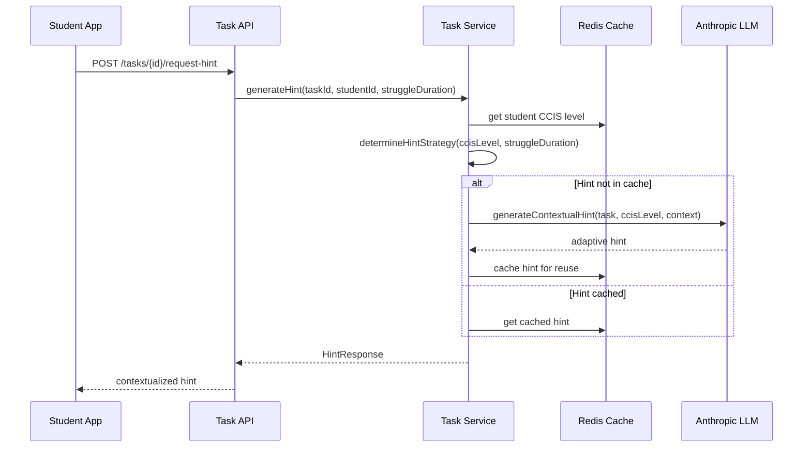

# Task Entity: Complete Implementation Specification

## Entity Definition

**Name**: Task Entity  
**Purpose**: Individual learning activities (5-minute micro-tasks or 15-30 minute fusion tasks) that students complete to demonstrate competency mastery. Each task generates behavioral signals used for CCIS assessment and adapts scaffolding based on student independence level.

**Core Responsibility**: Bridge abstract competencies with concrete learning experiences while capturing behavioral data that feeds into AI-powered CCIS calculations.

## Role and Responsibility

The Task Entity serves as the **primary learning interaction unit** in the Shrameva platform. It is responsible for:

1. **Content Delivery**: Presenting learning scenarios that mirror real workplace situations
2. **Signal Generation**: Capturing behavioral data for CCIS assessment (hint requests, error recovery, completion patterns)
3. **Adaptive Scaffolding**: Providing appropriate support based on student's current CCIS level
4. **Progress Tracking**: Enabling competency development measurement across 7 workplace skills
5. **Engagement Optimization**: Maintaining GenZ attention through micro-achievements and clear progress indicators

**Why This Entity is Critical**: Tasks are where actual transformation happens - they're the vehicle through which students develop genuine workplace competence rather than just consuming content.

## Prisma Model + TypeScript Class Structure

### Prisma Schema

```prisma
model Task {
  id                    String            @id @default(cuid())
  
  // Basic Task Information
  title                 String
  description           String
  instructions          String            @db.Text
  context               String            @db.Text  // Real workplace scenario
  expectedDuration      Int               // in minutes
  difficultyLevel       Float             // 0.1-1.0 scale
  
  // Competency & CCIS Targeting
  competencyId          String
  competency            Competency        @relation(fields: [competencyId], references: [id])
  targetCCISLevel       Int               // 1-4, primary CCIS level this task is designed for
  ccisLevelRange        Int[]             // [min, max] CCIS levels that can attempt this task
  
  // Task Classification
  taskType              TaskType          // MICRO_CONCEPT, MICRO_TASK, FUSION_TASK
  taskCategory          TaskCategory      // EMAIL_WRITING, DATA_ANALYSIS, PROBLEM_SOLVING, etc.
  isTransferTask        Boolean           @default(false) // Tests skill transfer to novel problems
  
  // Content Structure
  contentBlocks         Json              // Structured content: instructions, examples, interactive elements
  successCriteria       Json              // What constitutes successful completion
  assessmentRubric      Json              // Detailed scoring criteria
  
  // Adaptive Scaffolding Configuration
  hintsAvailable        Json              // CCIS-level specific hints and guidance
  scaffoldingConfig     Json              // Support level configuration per CCIS level
  
  // Industry Validation
  industryScenario      String?           // Real company/industry context
  employerValidated     Boolean           @default(false)
  lastValidationDate    DateTime?
  
  // Task Relationships
  prerequisiteTasks     String[]          // Task IDs that should be completed first
  followUpTasks         String[]          // Recommended next tasks
  relatedTasks          String[]          // Tasks in same competency area
  
  // Performance Analytics
  averageCompletionTime Int?              // minutes, updated from submissions
  averageSuccessRate    Float?            // 0.0-1.0, updated from submissions
  difficultyCalibration Float?            // actual vs intended difficulty
  
  // Content Management
  createdBy             String?           // Content creator ID
  reviewedBy            String?           // Content reviewer ID
  contentVersion        String            @default("1.0")
  tags                  String[]          // For content organization and search
  
  // Temporal Fields
  createdAt             DateTime          @default(now())
  updatedAt             DateTime          @updatedAt
  publishedAt           DateTime?
  deprecatedAt          DateTime?         // When task becomes outdated
  
  // Relationships
  submissions           TaskSubmission[]
  fusionTaskComponents  FusionTaskComponent[]
  taskAnalytics         TaskAnalytics[]
  
  @@map("tasks")
}

enum TaskType {
  MICRO_CONCEPT      // 2-minute knowledge introduction
  MICRO_TASK         // 5-minute practical exercise
  FUSION_TASK        // 15-30 minute cross-competency challenge
}

enum TaskCategory {
  // Business Communication
  EMAIL_WRITING
  PRESENTATION_SKILLS
  MEETING_FACILITATION
  CLIENT_COMMUNICATION
  
  // Data Analysis & Insights
  EXCEL_ANALYSIS
  SQL_QUERIES
  DATA_VISUALIZATION
  INSIGHT_GENERATION
  
  // Academic/Technical Knowledge
  PROGRAMMING_EXERCISE
  SYSTEM_DESIGN
  DEBUGGING_CHALLENGE
  TECHNICAL_DOCUMENTATION
  
  // Project Management
  PROJECT_PLANNING
  TIMELINE_CREATION
  RISK_ASSESSMENT
  STAKEHOLDER_COMMUNICATION
  
  // Critical Thinking & Problem Solving
  ROOT_CAUSE_ANALYSIS
  DECISION_FRAMEWORK
  SCENARIO_ANALYSIS
  CREATIVE_PROBLEM_SOLVING
  
  // Leadership & Collaboration
  TEAM_COORDINATION
  CONFLICT_RESOLUTION
  DELEGATION_EXERCISE
  MENTORING_SIMULATION
  
  // Innovation & Adaptability
  PROCESS_IMPROVEMENT
  TECHNOLOGY_ADOPTION
  CHANGE_MANAGEMENT
  CREATIVE_IDEATION
}

model FusionTaskComponent {
  id           String     @id @default(cuid())
  fusionTaskId String
  fusionTask   Task       @relation(fields: [fusionTaskId], references: [id])
  competencyId String
  competency   Competency @relation(fields: [competencyId], references: [id])
  weightage    Float      // 0.0-1.0, importance in overall assessment
  
  @@map("fusion_task_components")
}
```

### TypeScript Domain Class

```typescript
export class Task {
  constructor(
    public readonly id: TaskId,
    public readonly title: string,
    public readonly description: string,
    public readonly instructions: string,
    public readonly context: string,
    public readonly expectedDuration: number,
    public readonly difficultyLevel: number,
    public readonly competencyId: CompetencyId,
    public readonly targetCCISLevel: CCISLevel,
    public readonly ccisLevelRange: [number, number],
    public readonly taskType: TaskType,
    public readonly taskCategory: TaskCategory,
    public readonly contentBlocks: TaskContentBlocks,
    public readonly successCriteria: SuccessCriteria,
    public readonly assessmentRubric: AssessmentRubric,
    public readonly hintsAvailable: CCISLevelHints,
    public readonly scaffoldingConfig: ScaffoldingConfiguration,
    private domainEvents: DomainEvent[] = []
  ) {
    this.validateTaskConfiguration();
  }

  // Core behavior methods
  public generateAdaptiveHints(studentCCISLevel: CCISLevel, struggleDuration: number): HintResponse {
    const hintStrategy = this.scaffoldingConfig.getHintStrategy(studentCCISLevel);
    
    if (struggleDuration < hintStrategy.triggerDelay) {
      return HintResponse.noHint("Continue working");
    }

    const availableHints = this.hintsAvailable[studentCCISLevel];
    return new HintResponse(
      availableHints.getNextHint(),
      hintStrategy.detailLevel,
      this.calculateHintTiming(studentCCISLevel, struggleDuration)
    );
  }

  public assessCompletion(submission: TaskSubmissionData): TaskCompletionAssessment {
    const rubricScore = this.assessmentRubric.evaluate(submission);
    const criteriaScore = this.successCriteria.evaluate(submission);
    
    const isSuccessful = criteriaScore.score >= this.successCriteria.passingThreshold;
    const qualityLevel = this.determineQualityLevel(rubricScore.totalScore);

    this.addDomainEvent(new TaskCompletedEvent(
      this.id,
      submission.studentId,
      isSuccessful,
      rubricScore,
      submission.behavioralSignals
    ));

    return new TaskCompletionAssessment(
      isSuccessful,
      qualityLevel,
      rubricScore,
      criteriaScore,
      this.generateFeedback(rubricScore, criteriaScore)
    );
  }

  public shouldRecommendToStudent(studentProfile: StudentProfile): RecommendationResult {
    // Check prerequisite completion
    if (!this.arePrerequisitesMet(studentProfile)) {
      return RecommendationResult.notRecommended("Prerequisites not met");
    }

    // Check CCIS level appropriateness
    const studentCCISLevel = studentProfile.getCCISLevel(this.competencyId);
    if (!this.isAppropriateForCCISLevel(studentCCISLevel)) {
      return RecommendationResult.notRecommended("CCIS level mismatch");
    }

    // Calculate recommendation strength
    const recommendationStrength = this.calculateRecommendationStrength(studentProfile);
    
    return RecommendationResult.recommended(
      recommendationStrength,
      this.generateRecommendationReason(studentProfile)
    );
  }

  public updateDifficultyCalibration(performanceData: TaskPerformanceData): void {
    const actualDifficulty = this.calculateActualDifficulty(performanceData);
    const calibrationDrift = Math.abs(actualDifficulty - this.difficultyLevel);
    
    if (calibrationDrift > 0.2) { // Significant drift
      this.addDomainEvent(new TaskDifficultyRecalibrationEvent(
        this.id,
        this.difficultyLevel,
        actualDifficulty,
        calibrationDrift
      ));
    }
  }

  public generateTransferVariation(): Task {
    // Create a new task with same competency but novel context
    const novelContext = this.generateNovelContext();
    const adaptedInstructions = this.adaptInstructionsForTransfer();
    
    return new Task(
      TaskId.generate(),
      `${this.title} - Transfer Challenge`,
      this.description,
      adaptedInstructions,
      novelContext,
      this.expectedDuration,
      this.difficultyLevel * 1.1, // Slightly harder for transfer
      this.competencyId,
      this.targetCCISLevel,
      this.ccisLevelRange,
      this.taskType,
      this.taskCategory,
      this.adaptContentForTransfer(),
      this.successCriteria,
      this.assessmentRubric,
      this.hintsAvailable,
      this.scaffoldingConfig
    );
  }

  private validateTaskConfiguration(): void {
    if (this.expectedDuration <= 0 || this.expectedDuration > 60) {
      throw new InvalidTaskConfigurationError("Expected duration must be between 1-60 minutes");
    }
    
    if (this.difficultyLevel < 0.1 || this.difficultyLevel > 1.0) {
      throw new InvalidTaskConfigurationError("Difficulty level must be between 0.1-1.0");
    }
    
    if (this.targetCCISLevel < 1 || this.targetCCISLevel > 4) {
      throw new InvalidTaskConfigurationError("Target CCIS level must be between 1-4");
    }
  }

  // Domain Events
  public getUncommittedEvents(): DomainEvent[] {
    return [...this.domainEvents];
  }

  public markEventsAsCommitted(): void {
    this.domainEvents = [];
  }

  private addDomainEvent(event: DomainEvent): void {
    this.domainEvents.push(event);
  }
}
```

## Field Descriptions

### Core Identification Fields
- **id**: Unique identifier using CUID for better performance and collision resistance
- **title**: Human-readable task name (e.g., "Client Email Crisis Response")
- **description**: Brief overview of what the task teaches and why it matters
- **instructions**: Detailed step-by-step guidance for task completion
- **context**: Real workplace scenario that frames the task (e.g., "You're a junior analyst at a fintech startup...")

### Duration & Difficulty Management
- **expectedDuration**: Target completion time in minutes (2 for micro-concepts, 5 for micro-tasks, 15-30 for fusion tasks)
- **difficultyLevel**: Objective difficulty rating (0.1-1.0) calibrated from actual student performance
- **averageCompletionTime**: Actual completion time from submissions, used for calibration

### CCIS Integration Fields
- **targetCCISLevel**: Primary CCIS level (1-4) this task is designed to develop
- **ccisLevelRange**: Minimum and maximum CCIS levels that should attempt this task
- **scaffoldingConfig**: Configuration for adaptive support based on student's current CCIS level

### Content Structure Fields
- **contentBlocks**: Structured JSON containing interactive elements, examples, and media
- **successCriteria**: JSON defining what constitutes successful completion (measurable outcomes)
- **assessmentRubric**: Detailed scoring criteria for qualitative assessment
- **hintsAvailable**: CCIS-level specific hints and guidance strategies

### Industry Validation Fields
- **industryScenario**: Real company/industry context for authenticity
- **employerValidated**: Whether industry experts have validated this task
- **lastValidationDate**: When the task was last reviewed for industry relevance

### Relationship Fields
- **prerequisiteTasks**: Tasks that should be completed before this one
- **followUpTasks**: Recommended next tasks for continued learning
- **relatedTasks**: Tasks in the same competency area for lateral practice

## Field Population Methods

### User Input Fields (Content Creator/Instructor)
```typescript
interface TaskCreationInput {
  title: string;                    // Manual: "Email Crisis Management"
  description: string;              // Manual: "Handle difficult client communication"
  instructions: string;             // Manual: Detailed step-by-step guidance
  context: string;                  // Manual: Real workplace scenario
  expectedDuration: number;         // Manual: Target time in minutes
  competencyId: string;             // Selection: From available competencies
  targetCCISLevel: number;          // Selection: 1-4 based on design intent
  taskType: TaskType;               // Selection: MICRO_CONCEPT, MICRO_TASK, FUSION_TASK
  taskCategory: TaskCategory;       // Selection: EMAIL_WRITING, DATA_ANALYSIS, etc.
  contentBlocks: TaskContentBlocks; // Manual: Structured content creation
  successCriteria: SuccessCriteria; // Manual: Define success metrics
  assessmentRubric: AssessmentRubric; // Manual: Create scoring rubric
}
```

### AI-Generated Fields (System/LLM)
```typescript
interface TaskAIGeneration {
  hintsAvailable: CCISLevelHints;           // AI: Generate adaptive hints per CCIS level
  scaffoldingConfig: ScaffoldingConfiguration; // AI: Configure support strategies
  difficultyCalibration: number;            // AI: Calculate from performance data
  averageCompletionTime: number;            // AI: Aggregate from submissions
  averageSuccessRate: number;               // AI: Calculate from completion data
  tags: string[];                           // AI: Generate from content analysis
  relatedTasks: string[];                   // AI: Find similar tasks
  transferVariations: Task[];               // AI: Generate novel context versions
}
```

### System-Populated Fields (Automatic)
```typescript
interface TaskSystemFields {
  id: string;                      // Auto: CUID generation
  createdAt: Date;                 // Auto: Current timestamp
  updatedAt: Date;                 // Auto: On any modification
  publishedAt: Date;               // Auto: When approved for use
  contentVersion: string;          // Auto: Semantic versioning
  ccisLevelRange: [number, number]; // Auto: Calculate from targetCCISLevel
}
```

## Domain Events List

```typescript
// Task Lifecycle Events
export class TaskCreatedEvent extends DomainEvent {
  constructor(
    public readonly taskId: TaskId,
    public readonly competencyId: CompetencyId,
    public readonly targetCCISLevel: CCISLevel,
    public readonly createdBy: string
  ) {
    super('TaskCreated', taskId.value);
  }
}

export class TaskPublishedEvent extends DomainEvent {
  constructor(
    public readonly taskId: TaskId,
    public readonly publishedBy: string,
    public readonly validationStatus: ValidationStatus
  ) {
    super('TaskPublished', taskId.value);
  }
}

export class TaskDeprecatedEvent extends DomainEvent {
  constructor(
    public readonly taskId: TaskId,
    public readonly reason: string,
    public readonly replacementTaskId?: TaskId
  ) {
    super('TaskDeprecated', taskId.value);
  }
}

// Task Performance Events
export class TaskCompletedEvent extends DomainEvent {
  constructor(
    public readonly taskId: TaskId,
    public readonly studentId: StudentId,
    public readonly isSuccessful: boolean,
    public readonly rubricScore: RubricScore,
    public readonly behavioralSignals: BehavioralSignals
  ) {
    super('TaskCompleted', taskId.value);
  }
}

export class TaskDifficultyRecalibrationEvent extends DomainEvent {
  constructor(
    public readonly taskId: TaskId,
    public readonly previousDifficulty: number,
    public readonly newDifficulty: number,
    public readonly calibrationDrift: number
  ) {
    super('TaskDifficultyRecalibrated', taskId.value);
  }
}

// Content Management Events
export class TaskContentUpdatedEvent extends DomainEvent {
  constructor(
    public readonly taskId: TaskId,
    public readonly updatedBy: string,
    public readonly changedFields: string[],
    public readonly previousVersion: string,
    public readonly newVersion: string
  ) {
    super('TaskContentUpdated', taskId.value);
  }
}

export class TaskValidationRequiredEvent extends DomainEvent {
  constructor(
    public readonly taskId: TaskId,
    public readonly validationType: ValidationType,
    public readonly reason: string
  ) {
    super('TaskValidationRequired', taskId.value);
  }
}

// Learning Analytics Events
export class TaskRecommendationGeneratedEvent extends DomainEvent {
  constructor(
    public readonly taskId: TaskId,
    public readonly studentId: StudentId,
    public readonly recommendationStrength: number,
    public readonly reasons: string[]
  ) {
    super('TaskRecommendationGenerated', taskId.value);
  }
}

export class TaskTransferVariationCreatedEvent extends DomainEvent {
  constructor(
    public readonly originalTaskId: TaskId,
    public readonly transferTaskId: TaskId,
    public readonly novelContextType: string
  ) {
    super('TaskTransferVariationCreated', taskId.value);
  }
}
```

## Domain Services Required

### TaskRecommendationService
```typescript
export class TaskRecommendationService {
  async generateRecommendations(studentId: StudentId): Promise<TaskRecommendation[]> {
    const studentProfile = await this.studentRepository.findById(studentId);
    const availableTasks = await this.taskRepository.findRecommendableTasks(studentProfile);
    
    return availableTasks
      .map(task => this.calculateRecommendationScore(task, studentProfile))
      .filter(rec => rec.score > 0.6)
      .sort((a, b) => b.score - a.score)
      .slice(0, 5); // Top 5 recommendations
  }
  
  private calculateRecommendationScore(task: Task, profile: StudentProfile): TaskRecommendation {
    const ccisLevelMatch = this.assessCCISLevelMatch(task, profile);
    const learningPathAlignment = this.assessLearningPathAlignment(task, profile);
    const difficultyProgression = this.assessDifficultyProgression(task, profile);
    const noveltyScore = this.assessNovelty(task, profile);
    
    const overallScore = (
      ccisLevelMatch * 0.4 +
      learningPathAlignment * 0.3 +
      difficultyProgression * 0.2 +
      noveltyScore * 0.1
    );
    
    return new TaskRecommendation(task.id, overallScore, this.generateReason(task, profile));
  }
}
```

### TaskDifficultyCalibrationService
```typescript
export class TaskDifficultyCalibrationService {
  async calibrateTaskDifficulty(taskId: TaskId): Promise<DifficultyCalibration> {
    const performanceData = await this.getTaskPerformanceData(taskId);
    
    const actualDifficulty = this.calculateActualDifficulty(performanceData);
    const consistencyScore = this.calculateConsistency(performanceData);
    const discriminationIndex = this.calculateDiscrimination(performanceData);
    
    return new DifficultyCalibration(
      taskId,
      actualDifficulty,
      consistencyScore,
      discriminationIndex,
      this.generateCalibrationRecommendations(actualDifficulty, consistencyScore, discriminationIndex)
    );
  }
  
  private calculateActualDifficulty(performanceData: TaskPerformanceData): number {
    // Item Response Theory calculation
    const successRate = performanceData.successfulCompletions / performanceData.totalAttempts;
    const averageAttempts = performanceData.totalAttempts / performanceData.uniqueStudents;
    const timeToCompletionVariance = this.calculateTimeVariance(performanceData.completionTimes);
    
    return this.normalizeToScale(successRate, averageAttempts, timeToCompletionVariance);
  }
}
```

### TaskContentGenerationService
```typescript
export class TaskContentGenerationService {
  async generateTransferVariation(originalTask: Task): Promise<Task> {
    const novelContext = await this.generateNovelContext(originalTask);
    const adaptedInstructions = await this.adaptInstructions(originalTask, novelContext);
    
    return originalTask.createTransferVariation(novelContext, adaptedInstructions);
  }
  
  async generateAdaptiveHints(task: Task): Promise<CCISLevelHints> {
    const competencyFramework = await this.getCompetencyFramework(task.competencyId);
    
    return {
      level1: await this.generateLevel1Hints(task, competencyFramework), // Step-by-step guidance
      level2: await this.generateLevel2Hints(task, competencyFramework), // Strategic questions
      level3: await this.generateLevel3Hints(task, competencyFramework), // Validation checks
      level4: [] // No hints for autonomous level
    };
  }
  
  private async generateLevel1Hints(task: Task, framework: CompetencyFramework): Promise<Hint[]> {
    const prompt = `Generate step-by-step hints for a CCIS Level 1 (dependent learner) student attempting this task:
    
    Task: ${task.title}
    Context: ${task.context}
    Instructions: ${task.instructions}
    
    Level 1 students need:
    - Proactive guidance (appear after 10 seconds of struggle)
    - Step-by-step breakdown
    - High detail level
    - Clear next actions
    
    Generate 3-5 progressive hints that guide without giving away the answer.`;
    
    return this.llmService.generateHints(prompt);
  }
}
```

### TaskAnalyticsService
```typescript
export class TaskAnalyticsService {
  async analyzeTaskEffectiveness(taskId: TaskId): Promise<TaskEffectivenessReport> {
    const submissions = await this.getTaskSubmissions(taskId);
    const signals = await this.aggregateBehavioralSignals(submissions);
    
    return new TaskEffectivenessReport(
      taskId,
      this.calculateEngagementMetrics(submissions),
      this.calculateLearningOutcomes(submissions),
      this.calculateDiscriminationIndex(submissions),
      this.analyzeHintUsagePatterns(signals),
      this.generateImprovementRecommendations(submissions, signals)
    );
  }
  
  async detectTaskQualityIssues(taskId: TaskId): Promise<QualityIssue[]> {
    const issues: QualityIssue[] = [];
    
    const performanceData = await this.getTaskPerformanceData(taskId);
    
    // Detect low discrimination
    if (performanceData.discriminationIndex < 0.3) {
      issues.push(new QualityIssue(
        'LOW_DISCRIMINATION',
        'Task does not effectively distinguish between different skill levels',
        QualityIssueSeverity.HIGH
      ));
    }
    
    // Detect inappropriate difficulty
    if (performanceData.successRate < 0.2 || performanceData.successRate > 0.9) {
      issues.push(new QualityIssue(
        'INAPPROPRIATE_DIFFICULTY',
        'Task difficulty not calibrated correctly for target audience',
        QualityIssueSeverity.MEDIUM
      ));
    }
    
    // Detect gaming patterns
    const gamingIndicators = await this.detectGamingPatterns(taskId);
    if (gamingIndicators.confidence > 0.7) {
      issues.push(new QualityIssue(
        'GAMING_SUSCEPTIBLE',
        'Task may be susceptible to gaming or cheating',
        QualityIssueSeverity.HIGH
      ));
    }
    
    return issues;
  }
}
```

## Infrastructure Layer Design

### TaskRepository
```typescript
export interface TaskRepository {
  // Basic CRUD operations
  save(task: Task): Promise<void>;
  findById(id: TaskId): Promise<Task | null>;
  findByCompetency(competencyId: CompetencyId): Promise<Task[]>;
  delete(id: TaskId): Promise<void>;
  
  // Query methods for recommendations
  findRecommendableTasks(studentProfile: StudentProfile): Promise<Task[]>;
  findByDifficultyRange(min: number, max: number): Promise<Task[]>;
  findByCCISLevel(level: CCISLevel): Promise<Task[]>;
  
  // Analytics and performance queries
  findTasksNeedingCalibration(): Promise<Task[]>;
  findTasksNeedingValidation(): Promise<Task[]>;
  findPopularTasks(limit: number): Promise<Task[]>;
  
  // Content management
  findDraftTasks(): Promise<Task[]>;
  findPublishedTasks(): Promise<Task[]>;
  findDeprecatedTasks(): Promise<Task[]>;
  
  // Transfer and variation management
  findTransferVariations(originalTaskId: TaskId): Promise<Task[]>;
  findSimilarTasks(task: Task, limit: number): Promise<Task[]>;
}

export class PostgresTaskRepository implements TaskRepository {
  constructor(
    private prisma: PrismaClient,
    private eventPublisher: DomainEventPublisher
  ) {}
  
  async save(task: Task): Promise<void> {
    const taskData = this.mapToDbModel(task);
    
    await this.prisma.task.upsert({
      where: { id: task.id.value },
      create: taskData,
      update: taskData
    });
    
    // Publish domain events
    const events = task.getUncommittedEvents();
    for (const event of events) {
      await this.eventPublisher.publish(event);
    }
    task.markEventsAsCommitted();
  }
  
  async findRecommendableTasks(studentProfile: StudentProfile): Promise<Task[]> {
    const studentCCISLevels = studentProfile.getCCISLevels();
    
    const tasks = await this.prisma.task.findMany({
      where: {
        publishedAt: { not: null },
        deprecatedAt: null,
        OR: Object.entries(studentCCISLevels).map(([competencyId, ccisLevel]) => ({
          competencyId,
          targetCCISLevel: {
            gte: Math.max(1, ccisLevel - 1),
            lte: Math.min(4, ccisLevel + 1)
          }
        }))
      },
      include: {
        competency: true,
        submissions: {
          where: { studentId: studentProfile.studentId.value },
          select: { id: true, isSuccessful: true }
        }
      }
    });
    
    return tasks
      .filter(task => task.submissions.length === 0) // Not yet attempted
      .map(task => this.mapToDomainModel(task));
  }
  
  private mapToDbModel(task: Task): Prisma.TaskCreateInput {
    return {
      id: task.id.value,
      title: task.title,
      description: task.description,
      instructions: task.instructions,
      context: task.context,
      expectedDuration: task.expectedDuration,
      difficultyLevel: task.difficultyLevel,
      competency: { connect: { id: task.competencyId.value } },
      targetCCISLevel: task.targetCCISLevel,
      ccisLevelRange: task.ccisLevelRange,
      taskType: task.taskType,
      taskCategory: task.taskCategory,
      contentBlocks: task.contentBlocks as any,
      successCriteria: task.successCriteria as any,
      assessmentRubric: task.assessmentRubric as any,
      hintsAvailable: task.hintsAvailable as any,
      scaffoldingConfig: task.scaffoldingConfig as any,
      // ... other fields
    };
  }
}
```

### TaskCacheService
```typescript
export class TaskCacheService {
  constructor(
    private redis: RedisClient,
    private taskRepository: TaskRepository
  ) {}
  
  async getTask(taskId: TaskId): Promise<Task | null> {
    // L1: Memory cache for active tasks
    const memoryKey = `task:${taskId.value}`;
    const cachedTask = this.memoryCache.get(memoryKey);
    if (cachedTask) return cachedTask;
    
    // L2: Redis cache for frequently accessed tasks
    const redisKey = `task:${taskId.value}`;
    const redisCached = await this.redis.get(redisKey);
    if (redisCached) {
      const task = this.deserializeTask(redisCached);
      this.memoryCache.set(memoryKey, task, 300); // 5 minutes
      return task;
    }
    
    // L3: Database
    const task = await this.taskRepository.findById(taskId);
    if (task) {
      await this.redis.setex(redisKey, 3600, this.serializeTask(task)); // 1 hour
      this.memoryCache.set(memoryKey, task, 300);
    }
    
    return task;
  }
  
  async getRecommendedTasks(studentId: StudentId): Promise<Task[]> {
    const cacheKey = `recommendations:${studentId.value}`;
    const cached = await this.redis.get(cacheKey);
    
    if (cached) {
      return JSON.parse(cached).map(data => this.deserializeTask(data));
    }
    
    // Cache miss - compute recommendations
    const studentProfile = await this.studentRepository.findById(studentId);
    const recommendations = await this.taskRepository.findRecommendableTasks(studentProfile);
    
    // Cache for 15 minutes (recommendations change as student progresses)
    await this.redis.setex(cacheKey, 900, JSON.stringify(recommendations.map(task => this.serializeTask(task))));
    
    return recommendations;
  }
  
  async invalidateTaskCache(taskId: TaskId): Promise<void> {
    await this.redis.del(`task:${taskId.value}`);
    this.memoryCache.delete(`task:${taskId.value}`);
    
    // Also invalidate related caches
    await this.redis.del(`task:analytics:${taskId.value}`);
    await this.redis.del(`task:performance:${taskId.value}`);
  }
  
  private serializeTask(task: Task): string {
    return JSON.stringify({
      id: task.id.value,
      title: task.title,
      description: task.description,
      // ... serialize all relevant fields
    });
  }
  
  private deserializeTask(data: string): Task {
    const parsed = JSON.parse(data);
    return new Task(
      new TaskId(parsed.id),
      parsed.title,
      parsed.description,
      // ... reconstruct from serialized data
    );
  }
}
```

## Dependencies (npm packages)

### Core Dependencies
```json
{
  "dependencies": {
    "@nestjs/common": "^10.0.0",
    "@nestjs/core": "^10.0.0",
    "@nestjs/typeorm": "^10.0.0",
    "@prisma/client": "^5.0.0",
    "prisma": "^5.0.0",
    "class-validator": "^0.14.0",
    "class-transformer": "^0.5.1",
    "uuid": "^9.0.0",
    "cuid": "^3.0.0",
    "redis": "^4.6.0",
    "ioredis": "^5.3.0"
  },
  "devDependencies": {
    "@types/uuid": "^9.0.0",
    "jest": "^29.0.0",
    "@types/jest": "^29.0.0",
    "supertest": "^6.3.0"
  }
}
```

### Specific Package Justifications

**@anthropic-ai/sdk**: For LLM integration in content generation and hint creation
```typescript
import Anthropic from '@anthropic-ai/sdk';

// Used in TaskContentGenerationService for adaptive hint generation
const anthropic = new Anthropic({
  apiKey: process.env.ANTHROPIC_API_KEY,
});
```

**node-cache**: For in-memory caching of frequently accessed tasks
```typescript
import NodeCache from 'node-cache';

// L1 cache for task objects
const taskCache = new NodeCache({ 
  stdTTL: 300, // 5 minutes
  checkperiod: 60 // cleanup every minute
});
```

**mathjs**: For statistical calculations in difficulty calibration
```typescript
import { evaluate, std, mean } from 'mathjs';

// Used in TaskDifficultyCalibrationService
const calculateDiscriminationIndex = (responses: number[]): number => {
  const meanScore = mean(responses);
  const stdDev = std(responses);
  return stdDev / meanScore; // Coefficient of variation
};
```

**lodash**: For data manipulation in analytics and recommendations
```typescript
import _ from 'lodash';

// Used in TaskRecommendationService
const groupedByCompetency = _.groupBy(tasks, 'competencyId');
const sortedByDifficulty = _.sortBy(tasks, 'difficultyLevel');
```

## High Level Design (Data Flows)

### Task Creation Flow


### Task Recommendation Flow


### Task Completion & Signal Collection Flow


### Adaptive Hint Generation Flow


## API Layer (Controller + Endpoints)

### TaskController
```typescript
@Controller('tasks')
@ApiTags('tasks')
export class TaskController {
  constructor(
    private readonly taskService: TaskService,
    private readonly taskRecommendationService: TaskRecommendationService,
    private readonly taskAnalyticsService: TaskAnalyticsService
  ) {}

  @Post()
  @ApiOperation({ summary: 'Create a new task' })
  @ApiResponse({ status: 201, description: 'Task created successfully' })
  async createTask(@Body() createTaskDto: CreateTaskDto): Promise<TaskResponseDto> {
    const task = await this.taskService.createTask(createTaskDto);
    return TaskResponseDto.fromDomain(task);
  }

  @Get(':id')
  @ApiOperation({ summary: 'Get task by ID' })
  @ApiResponse({ status: 200, description: 'Task retrieved successfully' })
  @ApiResponse({ status: 404, description: 'Task not found' })
  async getTask(@Param('id') id: string): Promise<TaskResponseDto> {
    const task = await this.taskService.findById(new TaskId(id));
    if (!task) {
      throw new NotFoundException('Task not found');
    }
    return TaskResponseDto.fromDomain(task);
  }

  @Get()
  @ApiOperation({ summary: 'Get tasks with filtering' })
  @ApiQuery({ name: 'competencyId', required: false })
  @ApiQuery({ name: 'ccisLevel', required: false })
  @ApiQuery({ name: 'taskType', required: false })
  async getTasks(@Query() query: GetTasksQueryDto): Promise<TaskResponseDto[]> {
    const tasks = await this.taskService.findTasks(query);
    return tasks.map(task => TaskResponseDto.fromDomain(task));
  }

  @Post(':id/submit')
  @ApiOperation({ summary: 'Submit task completion' })
  @ApiResponse({ status: 200, description: 'Task submission processed' })
  async submitTask(
    @Param('id') taskId: string,
    @Body() submission: TaskSubmissionDto,
    @Req() request: AuthenticatedRequest
  ): Promise<TaskCompletionResponseDto> {
    const result = await this.taskService.processSubmission(
      new TaskId(taskId),
      new StudentId(request.user.id),
      submission
    );
    return TaskCompletionResponseDto.fromDomain(result);
  }

  @Post(':id/request-hint')
  @ApiOperation({ summary: 'Request adaptive hint for task' })
  @ApiResponse({ status: 200, description: 'Hint generated successfully' })
  async requestHint(
    @Param('id') taskId: string,
    @Body() hintRequest: HintRequestDto,
    @Req() request: AuthenticatedRequest
  ): Promise<HintResponseDto> {
    const hint = await this.taskService.generateAdaptiveHint(
      new TaskId(taskId),
      new StudentId(request.user.id),
      hintRequest.struggleDuration,
      hintRequest.context
    );
    return HintResponseDto.fromDomain(hint);
  }

  @Get(':id/analytics')
  @ApiOperation({ summary: 'Get task performance analytics' })
  @ApiResponse({ status: 200, description: 'Analytics retrieved successfully' })
  async getTaskAnalytics(@Param('id') taskId: string): Promise<TaskAnalyticsDto> {
    const analytics = await this.taskAnalyticsService.getTaskAnalytics(new TaskId(taskId));
    return TaskAnalyticsDto.fromDomain(analytics);
  }

  @Post(':id/calibrate-difficulty')
  @ApiOperation({ summary: 'Recalibrate task difficulty based on performance data' })
  @ApiResponse({ status: 200, description: 'Difficulty calibrated successfully' })
  async calibrateDifficulty(@Param('id') taskId: string): Promise<DifficultyCalibrationDto> {
    const calibration = await this.taskService.calibrateDifficulty(new TaskId(taskId));
    return DifficultyCalibrationDto.fromDomain(calibration);
  }

  @Post(':id/generate-transfer-variation')
  @ApiOperation({ summary: 'Generate transfer learning variation of task' })
  @ApiResponse({ status: 201, description: 'Transfer variation created successfully' })
  async generateTransferVariation(@Param('id') taskId: string): Promise<TaskResponseDto> {
    const transferTask = await this.taskService.generateTransferVariation(new TaskId(taskId));
    return TaskResponseDto.fromDomain(transferTask);
  }

  @Get(':id/similar')
  @ApiOperation({ summary: 'Find similar tasks for additional practice' })
  @ApiResponse({ status: 200, description: 'Similar tasks retrieved successfully' })
  async getSimilarTasks(
    @Param('id') taskId: string,
    @Query('limit') limit: number = 5
  ): Promise<TaskResponseDto[]> {
    const similarTasks = await this.taskRecommendationService.findSimilarTasks(
      new TaskId(taskId),
      limit
    );
    return similarTasks.map(task => TaskResponseDto.fromDomain(task));
  }

  @Put(':id')
  @ApiOperation({ summary: 'Update task content' })
  @ApiResponse({ status: 200, description: 'Task updated successfully' })
  async updateTask(
    @Param('id') taskId: string,
    @Body() updateTaskDto: UpdateTaskDto,
    @Req() request: AuthenticatedRequest
  ): Promise<TaskResponseDto> {
    const updatedTask = await this.taskService.updateTask(
      new TaskId(taskId),
      updateTaskDto,
      request.user.id
    );
    return TaskResponseDto.fromDomain(updatedTask);
  }

  @Delete(':id')
  @ApiOperation({ summary: 'Deprecate task (soft delete)' })
  @ApiResponse({ status: 200, description: 'Task deprecated successfully' })
  async deprecateTask(
    @Param('id') taskId: string,
    @Body() deprecationDto: DeprecateTaskDto
  ): Promise<void> {
    await this.taskService.deprecateTask(new TaskId(taskId), deprecationDto.reason);
  }
}

@Controller('students/:studentId/tasks')
@ApiTags('student-tasks')
export class StudentTaskController {
  constructor(
    private readonly taskRecommendationService: TaskRecommendationService,
    private readonly studentProgressService: StudentProgressService
  ) {}

  @Get('recommended')
  @ApiOperation({ summary: 'Get recommended tasks for student' })
  @ApiResponse({ status: 200, description: 'Recommendations retrieved successfully' })
  async getRecommendedTasks(
    @Param('studentId') studentId: string,
    @Query('limit') limit: number = 10
  ): Promise<TaskRecommendationDto[]> {
    const recommendations = await this.taskRecommendationService.getRecommendations(
      new StudentId(studentId),
      limit
    );
    return recommendations.map(rec => TaskRecommendationDto.fromDomain(rec));
  }

  @Get('next')
  @ApiOperation({ summary: 'Get next optimal task for student' })
  @ApiResponse({ status: 200, description: 'Next task retrieved successfully' })
  async getNextTask(@Param('studentId') studentId: string): Promise<TaskResponseDto> {
    const nextTask = await this.taskRecommendationService.getNextOptimalTask(
      new StudentId(studentId)
    );
    return TaskResponseDto.fromDomain(nextTask);
  }

  @Get('progress')
  @ApiOperation({ summary: 'Get student task completion progress' })
  @ApiResponse({ status: 200, description: 'Progress retrieved successfully' })
  async getTaskProgress(@Param('studentId') studentId: string): Promise<StudentTaskProgressDto> {
    const progress = await this.studentProgressService.getTaskProgress(new StudentId(studentId));
    return StudentTaskProgressDto.fromDomain(progress);
  }

  @Get('completed')
  @ApiOperation({ summary: 'Get tasks completed by student' })
  @ApiResponse({ status: 200, description: 'Completed tasks retrieved successfully' })
  async getCompletedTasks(
    @Param('studentId') studentId: string,
    @Query() pagination: PaginationDto
  ): Promise<PaginatedResponse<TaskSubmissionDto>> {
    const completedTasks = await this.studentProgressService.getCompletedTasks(
      new StudentId(studentId),
      pagination
    );
    return {
      data: completedTasks.data.map(submission => TaskSubmissionDto.fromDomain(submission)),
      total: completedTasks.total,
      page: completedTasks.page,
      pageSize: completedTasks.pageSize
    };
  }
}
```

### DTOs (Data Transfer Objects)
```typescript
export class CreateTaskDto {
  @ApiProperty({ description: 'Task title' })
  @IsString()
  @IsNotEmpty()
  title: string;

  @ApiProperty({ description: 'Task description' })
  @IsString()
  @IsNotEmpty()
  description: string;

  @ApiProperty({ description: 'Detailed instructions' })
  @IsString()
  @IsNotEmpty()
  instructions: string;

  @ApiProperty({ description: 'Real workplace context' })
  @IsString()
  @IsNotEmpty()
  context: string;

  @ApiProperty({ description: 'Expected duration in minutes' })
  @IsNumber()
  @Min(1)
  @Max(60)
  expectedDuration: number;

  @ApiProperty({ description: 'Competency ID' })
  @IsString()
  @IsNotEmpty()
  competencyId: string;

  @ApiProperty({ description: 'Target CCIS level (1-4)' })
  @IsNumber()
  @Min(1)
  @Max(4)
  targetCCISLevel: number;

  @ApiProperty({ enum: TaskType, description: 'Type of task' })
  @IsEnum(TaskType)
  taskType: TaskType;

  @ApiProperty({ enum: TaskCategory, description: 'Task category' })
  @IsEnum(TaskCategory)
  taskCategory: TaskCategory;

  @ApiProperty({ description: 'Structured content blocks' })
  @IsObject()
  contentBlocks: TaskContentBlocks;

  @ApiProperty({ description: 'Success criteria definition' })
  @IsObject()
  successCriteria: SuccessCriteria;

  @ApiProperty({ description: 'Assessment rubric' })
  @IsObject()
  assessmentRubric: AssessmentRubric;

  @ApiProperty({ description: 'Industry scenario context', required: false })
  @IsOptional()
  @IsString()
  industryScenario?: string;

  @ApiProperty({ description: 'Prerequisite task IDs', type: [String], required: false })
  @IsOptional()
  @IsArray()
  @IsString({ each: true })
  prerequisiteTasks?: string[];

  @ApiProperty({ description: 'Content tags', type: [String], required: false })
  @IsOptional()
  @IsArray()
  @IsString({ each: true })
  tags?: string[];
}

export class TaskResponseDto {
  @ApiProperty({ description: 'Task ID' })
  id: string;

  @ApiProperty({ description: 'Task title' })
  title: string;

  @ApiProperty({ description: 'Task description' })
  description: string;

  @ApiProperty({ description: 'Expected duration in minutes' })
  expectedDuration: number;

  @ApiProperty({ description: 'Difficulty level (0.1-1.0)' })
  difficultyLevel: number;

  @ApiProperty({ description: 'Target CCIS level' })
  targetCCISLevel: number;

  @ApiProperty({ enum: TaskType, description: 'Task type' })
  taskType: TaskType;

  @ApiProperty({ enum: TaskCategory, description: 'Task category' })
  taskCategory: TaskCategory;

  @ApiProperty({ description: 'Competency information' })
  competency: {
    id: string;
    name: string;
    description: string;
  };

  @ApiProperty({ description: 'Content blocks for rendering' })
  contentBlocks: TaskContentBlocks;

  @ApiProperty({ description: 'Success criteria' })
  successCriteria: SuccessCriteria;

  @ApiProperty({ description: 'Task tags', type: [String] })
  tags: string[];

  @ApiProperty({ description: 'Creation timestamp' })
  createdAt: Date;

  @ApiProperty({ description: 'Last update timestamp' })
  updatedAt: Date;

  @ApiProperty({ description: 'Publication status' })
  isPublished: boolean;

  static fromDomain(task: Task): TaskResponseDto {
    return {
      id: task.id.value,
      title: task.title,
      description: task.description,
      expectedDuration: task.expectedDuration,
      difficultyLevel: task.difficultyLevel,
      targetCCISLevel: task.targetCCISLevel,
      taskType: task.taskType,
      taskCategory: task.taskCategory,
      competency: {
        id: task.competencyId.value,
        name: task.competency?.name || '',
        description: task.competency?.description || ''
      },
      contentBlocks: task.contentBlocks,
      successCriteria: task.successCriteria,
      tags: task.tags || [],
      createdAt: task.createdAt,
      updatedAt: task.updatedAt,
      isPublished: task.publishedAt !== null
    };
  }
}

export class TaskSubmissionDto {
  @ApiProperty({ description: 'Student answers/responses' })
  @IsObject()
  responses: Record<string, any>;

  @ApiProperty({ description: 'Time spent on task in seconds' })
  @IsNumber()
  @Min(0)
  timeSpent: number;

  @ApiProperty({ description: 'Number of hints requested' })
  @IsNumber()
  @Min(0)
  hintsRequested: number;

  @ApiProperty({ description: 'Student confidence rating (1-5)' })
  @IsNumber()
  @Min(1)
  @Max(5)
  confidenceRating: number;

  @ApiProperty({ description: 'Self-assessment of performance (1-5)' })
  @IsNumber()
  @Min(1)
  @Max(5)
  selfAssessment: number;

  @ApiProperty({ description: 'Additional student feedback', required: false })
  @IsOptional()
  @IsString()
  feedback?: string;
}

export class HintRequestDto {
  @ApiProperty({ description: 'How long student has been struggling (seconds)' })
  @IsNumber()
  @Min(0)
  struggleDuration: number;

  @ApiProperty({ description: 'Current context or specific area of difficulty', required: false })
  @IsOptional()
  @IsString()
  context?: string;

  @ApiProperty({ description: 'Previous hints already shown', type: [String], required: false })
  @IsOptional()
  @IsArray()
  previousHints?: string[];
}

export class TaskRecommendationDto {
  @ApiProperty({ description: 'Recommended task' })
  task: TaskResponseDto;

  @ApiProperty({ description: 'Recommendation strength (0.0-1.0)' })
  score: number;

  @ApiProperty({ description: 'Reason for recommendation' })
  reason: string;

  @ApiProperty({ description: 'Estimated completion time for this student' })
  estimatedDuration: number;

  @ApiProperty({ description: 'Expected difficulty for this student' })
  expectedDifficulty: number;

  static fromDomain(recommendation: TaskRecommendation): TaskRecommendationDto {
    return {
      task: TaskResponseDto.fromDomain(recommendation.task),
      score: recommendation.score,
      reason: recommendation.reason,
      estimatedDuration: recommendation.estimatedDuration,
      expectedDifficulty: recommendation.expectedDifficulty
    };
  }
}
```

## No Auth (defer to later)

Authentication and authorization are intentionally deferred to maintain focus on core Task Entity functionality. For now, we assume:

1. **Controllers accept user context** through `@Req() request: AuthenticatedRequest`
2. **Domain services receive user IDs** as parameters where needed
3. **Repository methods are user-agnostic** - they don't enforce permissions
4. **Task visibility is open** - all published tasks are accessible to all students

### Future Auth Integration Points:
- **Task visibility permissions** (some tasks might be premium or course-specific)
- **Content creation permissions** (only authorized instructors can create tasks)
- **Student progress privacy** (students can only see their own progress)
- **Analytics access control** (instructors can see aggregate data, students cannot)

## GitHub Autopilot System Instructions

You are implementing the **Task Entity** for the Shrameva AI-powered career transformation platform. This entity is **CRITICAL** because it bridges abstract competencies with concrete learning experiences and generates behavioral signals for CCIS assessment.

### Implementation Priority & Context

**Why Task Entity is Next**: After Assessment Entity, Task Entity is the foundation that feeds the assessment system. Students interact primarily with tasks, and tasks generate the behavioral data that enables CCIS calculations.

**Core Purpose**: Create individual learning activities that adapt to student CCIS levels while capturing behavioral signals for competency assessment.

### Key Implementation Requirements

1. **CCIS Integration is PARAMOUNT**
   - Every task MUST support adaptive scaffolding based on student CCIS level (1-4)
   - Behavioral signal collection MUST be built into every task interaction
   - Hint systems MUST adapt based on independence level

2. **GenZ Learning Psychology**
   - 5-minute micro-tasks for attention span optimization
   - Immediate feedback and progress visualization
   - Gamification elements without compromising learning quality

3. **Industry Validation**
   - All tasks MUST be based on real workplace scenarios
   - Content MUST be validated by industry partners
   - Transfer learning variations MUST test skill application in novel contexts

4. **Performance & Scale**
   - Support 1000+ concurrent task attempts
   - Redis caching for frequently accessed tasks
   - Efficient behavioral signal collection without impacting UX

### Architecture Patterns to Follow

**Domain-Driven Design**: Use the established patterns from Assessment Entity
- Rich domain models with business logic
- Domain events for loose coupling
- Repository pattern for data access
- Service layer for orchestration

**AI Integration**: LLM-powered features are core to the platform
- Adaptive hint generation using Anthropic Claude
- Content variation creation for transfer learning
- Behavioral signal analysis for learning insights

**Event-Driven Architecture**: Follow the established event pattern
- TaskCompletedEvent → triggers CCIS assessment
- TaskDifficultyRecalibrationEvent → updates task metadata
- TaskValidationRequiredEvent → triggers human review

### Critical Success Factors

1. **Behavioral Signal Collection**: Every task interaction must capture data for CCIS assessment
2. **Adaptive Scaffolding**: Hints and support must adjust based on student independence level
3. **Industry Relevance**: All content must reflect real workplace scenarios
4. **Performance**: System must handle high concurrent usage without degradation
5. **Quality Assurance**: Built-in mechanisms to detect and prevent gaming

### Testing Requirements

**Unit Tests Required**:
- Task domain logic (hint generation, completion assessment)
- CCIS level appropriateness calculations
- Behavioral signal collection accuracy
- Content variation generation

**Integration Tests Required**:
- Task submission and assessment flow
- Cache invalidation on task updates
- Event publishing and handling
- LLM integration for content generation

### Implementation Order

1. **Core Domain Model** - Task entity with CCIS integration
2. **Repository Layer** - PostgreSQL persistence with caching
3. **Domain Services** - Recommendation, calibration, content generation
4. **API Controllers** - RESTful endpoints for task management
5. **Event Handlers** - Integration with assessment system
6. **LLM Integration** - Adaptive content generation
7. **Analytics Service** - Performance tracking and quality assurance

### Quality Standards

- **Google-level code quality** with comprehensive documentation
- **Type safety** throughout with proper TypeScript usage
- **Error handling** with domain-specific exceptions
- **Performance optimization** with multi-layer caching
- **Security considerations** even though auth is deferred

### Business Impact

This Task Entity directly enables the core value proposition: "Master 7 workplace competencies, achieve CCIS Level 3+ mastery, get placed in 6 months with ₹4L+ salary, or get 100% money back."

Tasks are where students develop actual competence, and the quality of this implementation directly impacts placement success rates.

**Remember**: You're building the foundation that transforms students from unemployable graduates into workplace-ready professionals. Every line of code contributes to that transformation.