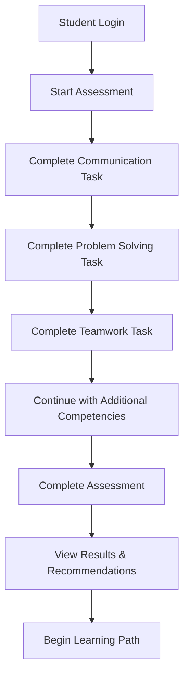
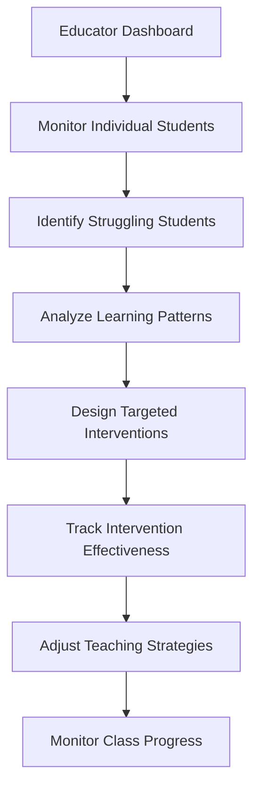
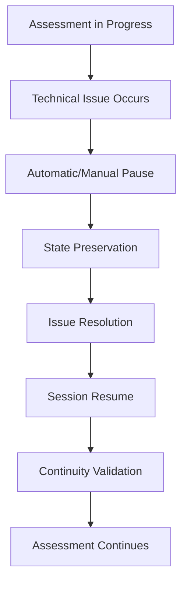

# CCIS Assessment API - Documentation & Testing Guide

This directory contains comprehensive documentation and testing resources for the CCIS (Confidence-Competence Independence Scale) Assessment API.

## 📋 Contents

### 1. API Documentation

- **[API_DOCUMENTATION.md](./API_DOCUMENTATION.md)** - Complete API reference with examples
- **[Postman Collection](./postman/)** - Ready-to-use API testing collection

### 2. Quick Start Guide

#### Prerequisites

- **API Server**: Running at `http://localhost:1905`
- **Authentication**: Bearer token (JWT)
- **Postman**: For interactive testing

#### Import Postman Collection

1. Open Postman
2. Import the collection: `docs/postman/CCIS_Assessment_API_Clean.postman_collection.json`
3. Set environment variables:
   - `baseUrl`: `http://localhost:1905`
   - `authToken`: Your JWT authentication token

## 🎯 What Each API Does

### Core Assessment APIs

#### 1. **Start Assessment Session**

- **Endpoint**: `POST /assessment/start`
- **Purpose**: Initiates a comprehensive CCIS assessment with adaptive configuration
- **Use Case**: Student begins a new competency evaluation session
- **Key Features**:
  - Cultural context adaptation (India, UAE, International)
  - Accessibility accommodations
  - Target competency selection
  - Dynamic difficulty adjustment
- **Response**: Session ID, configuration details, initial progress tracking

#### 2. **Submit Task Interaction**

- **Endpoint**: `POST /assessment/{sessionId}/interact`
- **Purpose**: Records real-time behavioral data during task completion
- **Use Case**: Student completes individual assessment tasks (communication, problem-solving, etc.)
- **Key Features**:
  - Behavioral signal collection (hints used, errors, confidence)
  - Task quality assessment
  - Real-time CCIS level calculation
  - Gaming detection algorithms
- **Response**: Updated competency levels, next task recommendation, progress update

#### 3. **Get Assessment Progress**

- **Endpoint**: `GET /assessment/person/{personId}/progress`
- **Purpose**: Comprehensive analytics for individual learner development
- **Use Case**: Students and educators track competency growth over time
- **Key Features**:
  - Historical trend analysis
  - Peer comparisons
  - Predictive analytics
  - Learning insights and recommendations
- **Response**: Detailed competency breakdown, learning patterns, achievement milestones

#### 4. **Complete Assessment Session**

- **Endpoint**: `PUT /assessment/{sessionId}/complete`
- **Purpose**: Finalizes assessment and generates comprehensive results
- **Use Case**: Student finishes assessment and receives detailed feedback
- **Key Features**:
  - Final CCIS level determination
  - Learning pathway recommendations
  - Intervention suggestions
  - Performance summary
- **Response**: Complete assessment report with actionable insights

### Session Management APIs

#### 5. **Pause Assessment Session**

- **Endpoint**: `PUT /session/{sessionId}/pause`
- **Purpose**: Handles technical interruptions while preserving state
- **Use Case**: Network issues, device problems, or scheduled breaks
- **Key Features**:
  - State preservation
  - Issue categorization
  - Resume instructions
  - Time tracking adjustment
- **Response**: Pause confirmation with recovery details

#### 6. **Resume Assessment Session**

- **Endpoint**: `PUT /session/{sessionId}/resume`
- **Purpose**: Restores paused sessions with continuity validation
- **Use Case**: Continuing assessment after technical resolution
- **Key Features**:
  - State validation
  - Context restoration
  - Time adjustments
  - Behavioral continuity checks
- **Response**: Resume confirmation with any necessary adjustments

#### 7. **Extend Session Time**

- **Endpoint**: `PUT /session/{sessionId}/extend`
- **Purpose**: Provides additional time for legitimate delays
- **Use Case**: Technical difficulties cause time loss
- **Key Features**:
  - Justified time extensions
  - Audit trail maintenance
  - Fair assessment conditions
  - Administrative oversight
- **Response**: Extension approval with new time limits

### Analytics APIs

#### 8. **Individual Analytics**

- **Endpoint**: `GET /analytics/person/{personId}`
- **Purpose**: Deep learning profile analysis for individual students
- **Use Case**: Personalized learning recommendations and intervention planning
- **Key Features**:
  - Learning style identification
  - Performance pattern analysis
  - Optimal learning conditions
  - Intervention effectiveness tracking
- **Response**: Comprehensive learner profile with actionable insights

#### 9. **Custom Analytics Query**

- **Endpoint**: `POST /analytics/custom`
- **Purpose**: Flexible analytics for research and institutional insights
- **Use Case**: Educational research, institutional reporting, policy decisions
- **Key Features**:
  - Multi-dimensional analysis
  - Custom metrics and filters
  - Aggregated insights
  - Trend identification
- **Response**: Structured data with statistical summaries

#### 10. **Cohort Analytics**

- **Endpoint**: `GET /analytics/cohort/{cohortId}`
- **Purpose**: Group-level performance analysis and comparisons
- **Use Case**: Classroom management, curriculum effectiveness, program evaluation
- **Key Features**:
  - Class-level summaries
  - Inter-cohort comparisons
  - Competency distributions
  - Achievement gap analysis
- **Response**: Group analytics with comparative benchmarks

## 🔄 Sample User Flows

### Flow 1: Complete Student Assessment Journey

This represents the typical student experience from start to finish:



**Step-by-Step Process:**

1. **Authentication & Setup**
   - Student logs in and receives JWT token
   - System determines appropriate assessment configuration
   - Cultural context and accessibility needs are configured

2. **Assessment Initiation**
   - `POST /assessment/start` with comprehensive configuration
   - System creates personalized session with adaptive difficulty
   - Initial behavioral baseline is established

3. **Task Completion Cycle** (Repeated for each competency)
   - Student receives task appropriate to current CCIS level
   - `POST /assessment/{sessionId}/interact` records all behavioral data
   - Real-time analysis provides immediate feedback
   - Next task difficulty is dynamically adjusted

4. **Session Completion**
   - `PUT /assessment/{sessionId}/complete` finalizes evaluation
   - Comprehensive results are generated
   - Learning recommendations are provided

5. **Progress Review**
   - `GET /assessment/person/{personId}/progress` shows growth
   - Historical trends and peer comparisons are available
   - Predictive analytics suggest future learning paths

### Flow 2: Educator Monitoring & Intervention

This shows how educators use the system for classroom management:



**Key Educator Activities:**

1. **Individual Student Monitoring**
   - `GET /analytics/person/{studentId}` for detailed insights
   - Identify learning patterns and optimal conditions
   - Track competency development over time

2. **Cohort Analysis**
   - `GET /analytics/cohort/{classId}` for class-level insights
   - Compare performance across different groups
   - Identify curriculum effectiveness gaps

3. **Custom Research Queries**
   - `POST /analytics/custom` for specific investigations
   - Analyze intervention effectiveness
   - Research learning methodology impact

### Flow 3: Session Recovery During Technical Issues

This demonstrates the system's resilience to technical problems:



**Recovery Process:**

1. **Issue Detection**
   - Network connectivity problems
   - Device failures or browser crashes
   - Scheduled maintenance or breaks

2. **Session Preservation**
   - `PUT /session/{sessionId}/pause` saves current state
   - All progress and behavioral context is maintained
   - Clear recovery instructions are provided

3. **Resume Process**
   - `PUT /session/{sessionId}/resume` restores session
   - State validation ensures data integrity
   - Time adjustments maintain fair assessment conditions

## 🛠️ Technical Implementation

### Authentication & Security

- **Bearer Token Authentication**: All endpoints require valid JWT tokens
- **Role-Based Access**: Students, Educators, Administrators have different permissions
- **Data Privacy**: Configurable privacy settings and consent management
- **Audit Trails**: Complete logging of all assessment activities

### Performance & Scalability

- **Real-time Processing**: Behavioral signal analysis within 150ms
- **Concurrent Sessions**: Support for hundreds of simultaneous assessments
- **Data Integrity**: Optimistic concurrency control and validation
- **Resilient Architecture**: Automatic recovery from technical failures

### Cultural Adaptation

- **Multi-Regional Support**: India, UAE, and International contexts
- **Language Preferences**: Multi-language assessment delivery
- **Cultural Sensitivity**: Region-specific validation and assessment criteria
- **Accessibility**: Comprehensive accommodation support

## 📊 API Response Examples

### Successful Assessment Start

```json
{
  "sessionId": "session-789",
  "status": "initializing",
  "assessmentInfo": {
    "assessmentType": "comprehensive",
    "targetCompetencies": ["communication", "problem_solving", "teamwork"],
    "culturalContext": "INDIA",
    "estimatedTasks": 15
  },
  "configuration": {
    "difficultyLevel": "adaptive",
    "scaffoldingEnabled": true,
    "gamingDetectionActive": true
  }
}
```

### Task Interaction Response

```json
{
  "sessionId": "session-789",
  "status": "processed",
  "competencyUpdates": {
    "communication": {
      "previousLevel": 2.1,
      "currentLevel": 2.3,
      "confidence": 0.82
    }
  },
  "recommendations": ["Consider attempting more complex communication tasks"],
  "nextTask": {
    "competency": "problem_solving",
    "difficulty": "intermediate"
  }
}
```

### Progress Analytics Response

```json
{
  "personId": "person-123",
  "overallSummary": {
    "averageLevel": 2.4,
    "averageConfidence": 0.76,
    "progressTrend": "improving"
  },
  "competencyProgress": [
    {
      "competency": "communication",
      "currentLevel": 2.8,
      "confidence": 0.84,
      "strengths": ["written_communication", "presentation_skills"],
      "improvementAreas": ["active_listening"]
    }
  ]
}
```

## 🎯 Business Value & Impact

### For Students

- **Personalized Learning**: Adaptive assessment matches individual learning pace
- **Real-time Feedback**: Immediate insights into competency development
- **Career Readiness**: Industry-aligned competency evaluation
- **Progress Tracking**: Clear visibility into skill development journey

### For Educators

- **Evidence-Based Teaching**: Data-driven insights for instructional decisions
- **Early Intervention**: Identification of students requiring additional support
- **Curriculum Optimization**: Understanding of effective teaching strategies
- **Outcome Measurement**: Quantifiable assessment of educational impact

### For Institutions

- **Quality Assurance**: Consistent competency measurement across programs
- **Placement Success**: Better preparation for industry requirements
- **Accreditation Support**: Comprehensive competency documentation
- **Research Capabilities**: Advanced analytics for educational research

## 🚀 Getting Started

### 1. Import Postman Collection

```bash
# Download the collection
curl -o ccis-api.json https://your-domain.com/docs/postman/CCIS_Assessment_API_Clean.postman_collection.json

# Import into Postman and configure environment variables
```

### 2. Test Basic Connectivity

```bash
# Health check
curl -X GET http://localhost:1905/

# Expected response: {"message": "CCIS Assessment API is running"}
```

### 3. Start Your First Assessment

```bash
# Replace YOUR_TOKEN with actual JWT
curl -X POST http://localhost:1905/assessment/start \
  -H "Content-Type: application/json" \
  -H "Authorization: Bearer YOUR_TOKEN" \
  -d '{
    "personId": "student-001",
    "assessmentType": "comprehensive",
    "culturalContext": "INDIA"
  }'
```

## 📞 Support & Documentation

- **API Documentation**: Complete reference in `API_DOCUMENTATION.md`
- **Interactive Docs**: Available at `http://localhost:1905/api` when server is running
- **Issue Tracking**: GitHub repository issues section
- **Technical Support**: development team contact information

This comprehensive API enables sophisticated competency assessment and learning analytics, supporting the complete educational journey from initial evaluation through career placement.
